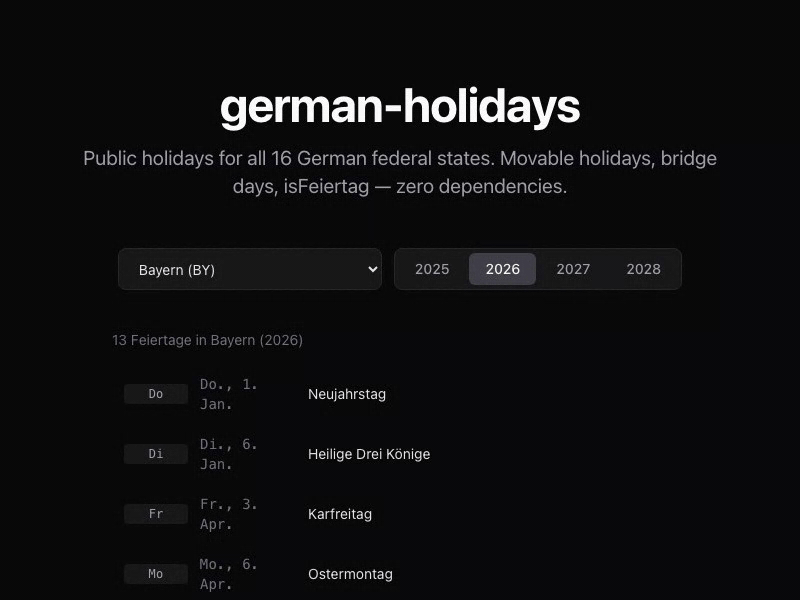

<p align="center"></p>

<h1 align="center">german-holidays</h1>

<p align="center">German public holidays for all 16 states. Movable holidays, bridge days, isFeiertag — TypeScript-first, zero dependencies, CLI included.</p>

<p align="center">
  <a href="https://www.npmjs.com/package/german-holidays"></a>
  <a href="https://bundlephobia.com/package/german-holidays"></a>
  <a href="https://github.com/mulkatz/german-holidays/blob/main/LICENSE"></a>
</p>

<p align="center"></p>

<p align="center">
  <a href="https://german-holidays.mulkatz.dev"><strong>→ Live Demo</strong></a>
</p>

## Features

- **All 16 federal states** — correct holiday rules per Bundesland
- **Movable holidays** — Easter, Pentecost, Corpus Christi, etc. calculated automatically
- **Brückentage** — find bridge day opportunities to maximize your time off
- **CLI included** — `npx german-holidays 2026 BY`
- **TypeScript-first** — full type safety, no `@types` needed
- **Zero dependencies** — pure date arithmetic, no date library
- **Tiny** — <2KB gzipped (library), tree-shakeable
- **Dual format** — ESM + CJS

## Install

```bash
npm install german-holidays
```

## Quick Start

```ts
import { getFeiertage, isFeiertag, getBrueckentage } from 'german-holidays';

// Get all holidays for Bayern 2026
const holidays = getFeiertage(2026, 'BY');

// Check if a date is a holiday
const result = isFeiertag('2026-12-25', 'BY');
// → { date: '2026-12-25', name: '1. Weihnachtstag', ... }

// Find bridge day opportunities
const brueckentage = getBrueckentage(2026, 'BY');
// → [{ date: '2026-05-15', feiertag: 'Christi Himmelfahrt', urlaubstage: 1, freieTage: 4, ... }]
```

## CLI

```bash
# All nationwide holidays
npx german-holidays 2026

# Holidays for a specific state
npx german-holidays 2026 BY

# Bridge day opportunities
npx german-holidays --brueckentage 2026 NW

# English names
npx german-holidays 2026 BY --en
```

## API

### `getFeiertage(year, bundesland, options?)`

Returns all public holidays for a given year and state.

```ts
const holidays = getFeiertage(2026, 'BY');
// → Feiertag[]
```

| Parameter | Type | Description |
|-----------|------|-------------|
| `year` | `number` | Year (e.g. 2026) |
| `bundesland` | `Bundesland` | State code (e.g. `'BY'`, `'NW'`, `'BE'`) |
| `options.lang` | `'de' \| 'en'` | Language for names. Default: `'de'` |

### `isFeiertag(date, bundesland)`

Check if a date is a public holiday. Returns the holiday or `undefined`.

```ts
isFeiertag('2026-12-25', 'BY');  // → Feiertag
isFeiertag('2026-03-15', 'BY');  // → undefined
isFeiertag(new Date(), 'BY');    // Date objects work too
```

### `getBrueckentage(year, bundesland)`

Calculate bridge day opportunities — workdays between holidays and weekends.

```ts
const bridges = getBrueckentage(2026, 'BY');
// → Brueckentag[]
```

Each `Brueckentag` contains:

| Field | Type | Description |
|-------|------|-------------|
| `date` | `string` | The vacation day to take |
| `feiertag` | `string` | Connected holiday name |
| `urlaubstage` | `number` | Vacation days needed |
| `freieTage` | `number` | Total consecutive days off |
| `start` | `string` | Start of break |
| `end` | `string` | End of break |

### `getGesetzlicheFeiertage(year, options?)`

Returns only nationwide holidays (9 per year).

### `easterSunday(year)`

Returns `[month, day]` for Easter Sunday. Useful for custom calculations.

```ts
easterSunday(2026); // → [4, 5] (April 5)
```

## State Codes

| Code | State |
|------|-------|
| `BW` | Baden-Württemberg |
| `BY` | Bayern |
| `BE` | Berlin |
| `BB` | Brandenburg |
| `HB` | Bremen |
| `HH` | Hamburg |
| `HE` | Hessen |
| `MV` | Mecklenburg-Vorpommern |
| `NI` | Niedersachsen |
| `NW` | Nordrhein-Westfalen |
| `RP` | Rheinland-Pfalz |
| `SL` | Saarland |
| `SN` | Sachsen |
| `ST` | Sachsen-Anhalt |
| `SH` | Schleswig-Holstein |
| `TH` | Thüringen |

## Types

```ts
import type { Bundesland, Feiertag, Brueckentag, DateString } from 'german-holidays';
```

## License

MIT
